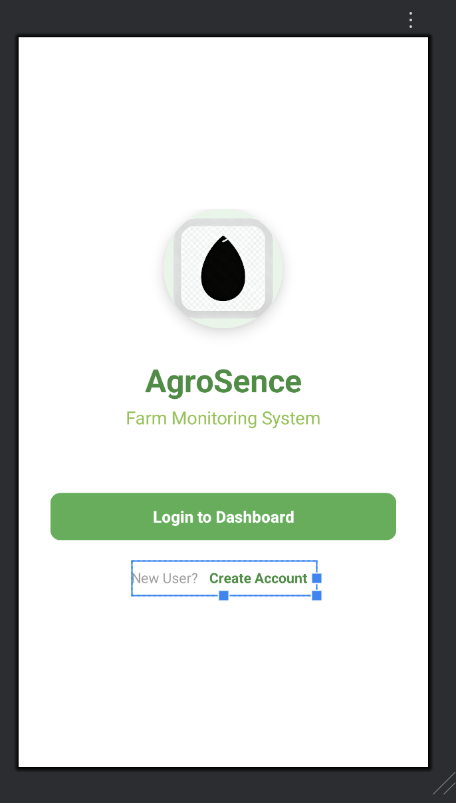
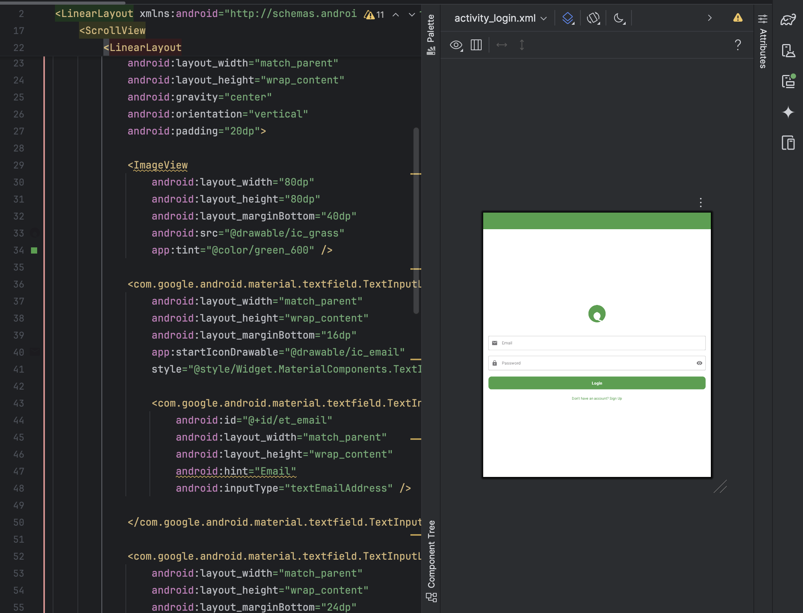
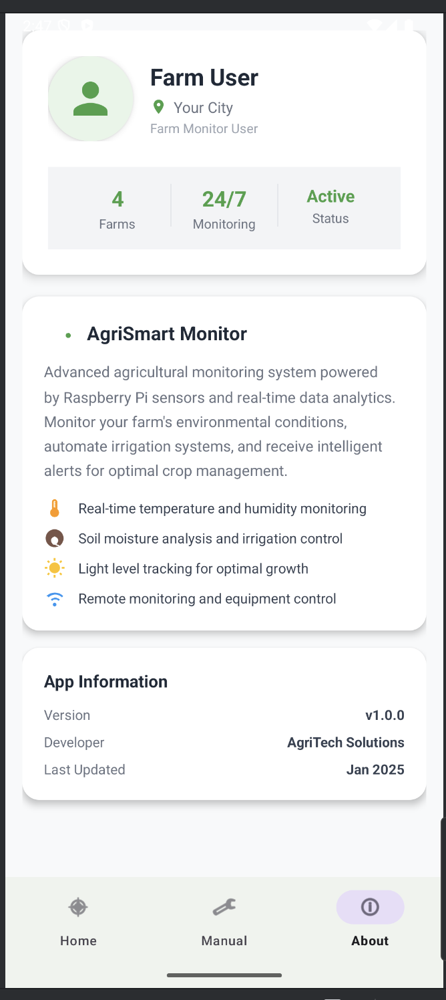

🌾 AgriSmart Monitor

**Advanced Agricultural Monitoring System**

A comprehensive Android + IoT-based system for **real-time farm monitoring and automation**, built using **Raspberry Pi**, **Firebase**, and **Java (Android)**.  
Monitor temperature, humidity, soil moisture, and light intensity — control irrigation, lighting, and ventilation remotely via a smart mobile app.

---

<div align="center">
  
</div>

---

## 📱 Screenshots

<table>
  <tr>
    <td align="center">
      
      <br><strong>Starting Screen</strong>
    </td>
    <td align="center">
      
      <br><strong>Login Screen</strong>
    </td>
    <td align="center">
      
      <br><strong>Farm Dashboard</strong>
    </td>
  </tr>
  <tr>
    <td align="center">
      
      <br><strong>Equipment Control</strong>
    </td>
    <td align="center">
      
      <br><strong>User Profile</strong>
    </td>
  </tr>
</table>

---

## ✨ Features

### 🔍 **Real-Time Monitoring**
- Temperature and humidity tracking
- Soil moisture level analysis
- Light intensity measurement
- Raspberry Pi connectivity status
- Weather API integration (OpenWeatherMap)

### 🎮 **Manual Equipment Control**
- Toggle irrigation, lights, and fan manually
- Emergency stop functionality
- Real-time relay synchronization via Firebase
- Sound alarm on motion detection

### ⚙️ **Automation**
- Auto irrigation when soil is dry
- Auto lighting during low light or at night
- Alarm triggered on motion detection
- Continuous Firebase data sync

### 📊 **Data Management**
- Firebase Realtime Database integration
- Historical data logging (via Firebase)
- Offline data caching (on Android)

### 👤 **User Experience**
- Material Design UI
- Modern animations & transitions
- Farm selector and live dashboard
- Weather-based insights

---

## ⚙️ Hardware Structure & System Logic

### 🧩 **Hardware Overview**

The system uses a **Raspberry Pi** as the IoT controller that gathers sensor data, runs automation logic, and communicates with **Firebase**.  
The **Android app** provides real-time data visualization and remote control of farm equipment.

<div align="center">
  
</div>

---

### 🔌 **Hardware Components**

| Component | Function | GPIO Pin |
|------------|-----------|----------|
| **DHT22** | Temperature & humidity | GPIO 4 |
| **Soil Moisture Sensor** | Detects soil dryness | GPIO 17 |
| **LDR (Light Sensor)** | Measures light intensity | GPIO 27 |
| **IR Motion Sensor** | Motion detection for security | GPIO 22 |
| **Relay (Pump)** | Controls water pump | GPIO 23 |
| **Relay (Light)** | Controls grow light | GPIO 24 |
| **Relay (Fan)** | Controls ventilation fan | GPIO 25 |
| **Relay (Alarm)** | Triggers buzzer/alarm | GPIO 26 |

---

### 🧠 **System Logic**

#### 1️⃣ Sensor Data Collection
- Raspberry Pi continuously reads:
    - DHT22 → Temperature, Humidity
    - Soil Moisture Sensor → Dry/Wet state
    - LDR → Light intensity (Bright/Dark)
    - IR Sensor → Motion detected or not

Data is updated every **1 second** and pushed to **Firebase**.

#### 2️⃣ Firebase Synchronization
- Python script (`farm.py`) on Pi publishes sensor data to:
  farms/farm_1/sensors/

csharp
Copy code
- The Android app listens in real-time to update UI dashboards instantly.

#### 3️⃣ Automation Logic (on Raspberry Pi)
- **Auto Irrigation**: If soil is dry → Turn ON pump for 60 seconds.
- **Auto Lighting**: If light is low or time between 6 PM–6 AM → Turn ON grow lights.
- **Auto Fan**: Controlled manually or extended logic based on temperature.
- **Motion Detection**: IR sensor triggers buzzer and Firebase alert.

#### 4️⃣ Manual Control (from Android App)
Firebase Realtime Database node:
```json
"controls": {
"lighting": { "preset": "manual", "enabled": true },
"ventilation": { "enabled": false },
"irrigation": { "autoMode": false, "enabled": true },
"emergency": { "stopped": false }
}
Raspberry Pi listens for these changes and toggles relays accordingly.

5️⃣ Alarm Logic
When motion detected:

Activate buzzer

Update motionDetected = true in Firebase

Android app shows visual alert

6️⃣ Fail-Safe Operation
If any sensor fails, system uses simulated data to keep Firebase updates consistent.

All relays are turned OFF safely on shutdown.

🔋 Power & Wiring Guidelines
Raspberry Pi 3B+ or later, powered via 5V 2.5A supply.

Ensure common ground between sensors and relays.

Use optocoupler relay boards for isolation.

For longer sensor wires, use shielded cables and pull-up resistors.

🗺️ System Data Flow
yaml
Copy code
┌────────────────────────────┐
│        Raspberry Pi        │
│ (Python + Firebase Admin)  │
├────────────────────────────┤
│ Sensors: DHT22, Soil, LDR, IR │
│ Relays: Pump, Light, Fan, Alarm│
├────────────┬─────────────────┤
│ Automation │ Firebase Sync   │
└───────┬────┘                 │
        │                      ▼
        │               🔥 Firebase
        │                      │
        ▼                      ▼
  Android App ←────────→ Realtime DB
      │
      ▼
   👨‍🌾 User Dashboard
🏗️ Project Structure
css
Copy code
app/
├── src/main/java/com/farmmonitor/agriai/
│   ├── fragments/
│   │   └── HomeFragment.java
│   ├── AboutFragment.java
│   ├── FarmDataFragment.java
│   ├── HomeActivity.java
│   ├── LoginActivity.java
│   ├── MainActivity.java
│   ├── MainDashboardActivity.java
│   ├── ManualFragment.java
│   ├── RetrofitClient.java
│   ├── SensorData.java
│   ├── SignUpActivity.java
│   ├── StartingActivity.java
│   ├── WeatherApi.java
│   └── WeatherResponse.java
│
├── src/main/res/
│   ├── layout/
│   ├── menu/
│   ├── values/
│   └── drawable/
│
├── build.gradle (Module: app)
└── AndroidManifest.xml
🛠️ Technologies Used
Frontend (Android)
Language: Java

UI: Material Design Components

Navigation: Bottom Navigation + Fragments

Animations: ObjectAnimator, MotionLayout

Architecture: MVVM Pattern

Backend (IoT)
Device: Raspberry Pi (Python 3)

Database: Firebase Realtime Database

Auth: Firebase Authentication

Cloud Communication: Firebase Admin SDK

Local Storage: SharedPreferences

External APIs
Weather Data: OpenWeatherMap API

HTTP Client: Retrofit 2 + Gson Converter

📋 Prerequisites
Software
Android Studio (Arctic Fox or later)

Java 8+

Gradle 7+

Raspberry Pi OS (Bookworm/Bullseye)

Python 3.9+

Hardware
Raspberry Pi 3B+ or higher

DHT22 Sensor

Soil Moisture Sensor

LDR Sensor

IR Motion Sensor

4-Channel Relay Module

5V Power Supply

🚀 Installation & Setup
1️⃣ Clone the Repository
bash
Copy code
git clone https://github.com/raj9097/AgroSence.git
cd AgroSence
2️⃣ Android App Setup
Open in Android Studio → Sync Gradle

Download google-services.json from Firebase → place in /app/ folder

Add your OpenWeatherMap API key in FarmDataFragment.java

3️⃣ Raspberry Pi Setup
bash
Copy code
cd ~/home/pi/farm-monitor
python3 -m venv venv
source venv/bin/activate
pip install firebase-admin RPi.GPIO Adafruit_DHT
python3 farm.py
4️⃣ Auto Start on Boot (Systemd)
Create service:

bash
Copy code
sudo nano /etc/systemd/system/farm-automation.service
Add:

ini
Copy code
[Unit]
Description=Farm Automation Service
After=network.target

[Service]
User=admin
WorkingDirectory=/home/admin/home/pi/farm-monitor
ExecStart=/home/admin/home/pi/farm-monitor/venv/bin/python3 /home/admin/home/pi/farm-monitor/farm.py
Restart=always
RestartSec=5

[Install]
WantedBy=multi-user.target
Then enable:

bash
Copy code
sudo systemctl daemon-reload
sudo systemctl enable farm-automation.service
sudo systemctl start farm-automation.service
🔧 Firebase Structure
json
Copy code
{
  "farms": {
    "farm_1": {
      "sensors": {
        "temperature": 25.5,
        "humidity": 60.2,
        "soilMoisture": 100,
        "lightLevel": 800,
        "motionDetected": false,
        "lastUpdate": 1731444100000
      },
      "controls": {
        "irrigation": { "autoMode": true, "enabled": false },
        "lighting": { "preset": "manual", "enabled": true },
        "ventilation": { "enabled": false },
        "emergency": { "stopped": false }
      }
    }
  }
}
📊 Usage
Launch app → Login

Select a farm → View live sensor data

Use Manual Tab for pump/light/fan control

Enable Auto Mode for irrigation/light automation

Check motion alerts in real-time

🧠 Roadmap
Version 2.0
Push notifications for alerts

Graphs for historical data

ML-based weather prediction

Dark mode

Version 2.1
Offline synchronization

Custom alert thresholds

Multi-language support

👥 Authors
Raj Raushan Kumar – GitHub
💡 Project Lead, Android + IoT Developer

🙏 Acknowledgments
Firebase team for cloud infrastructure

OpenWeatherMap for weather data API

Raspberry Pi Foundation for IoT hardware

Material Design team for UI/UX inspiration

📞 Support
For queries or contributions:
📧 rajraushankumar749@gmail.com
🐛 GitHub Issues

<div align="center"> <strong>🌱 Built with ❤️ for Sustainable Agriculture 🌍</strong> </div> ```